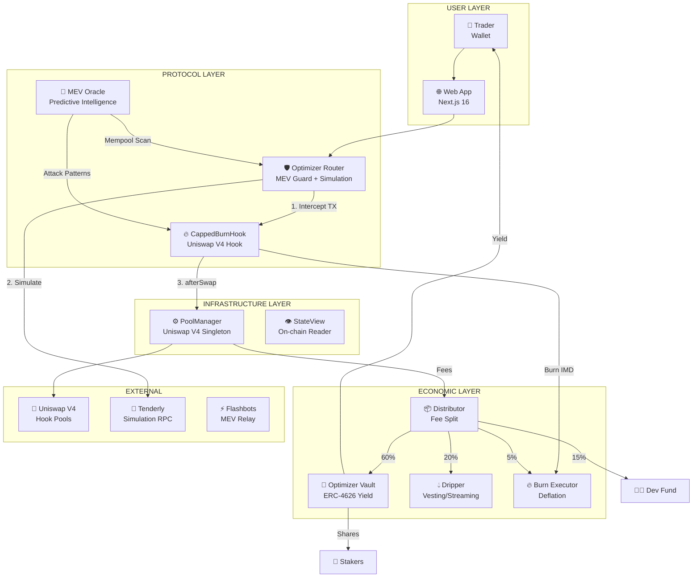
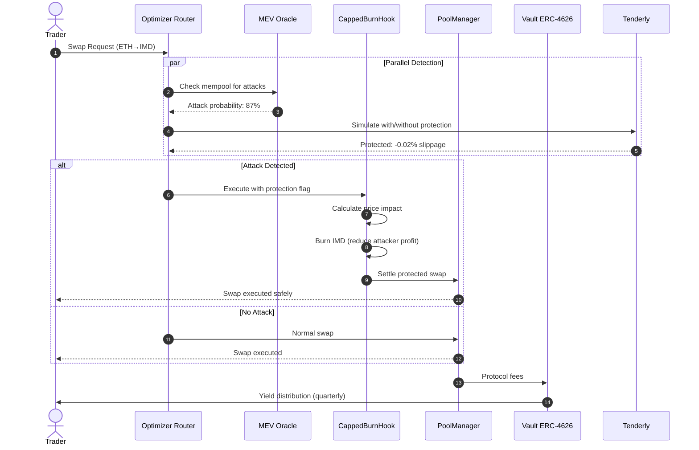
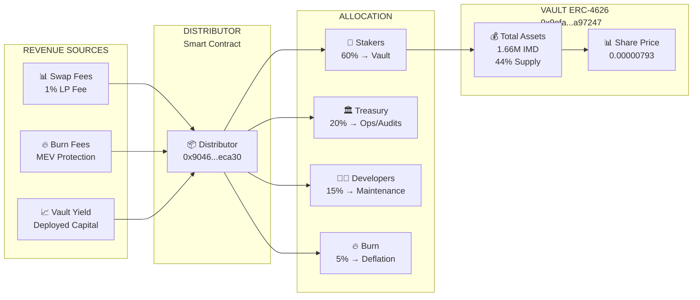
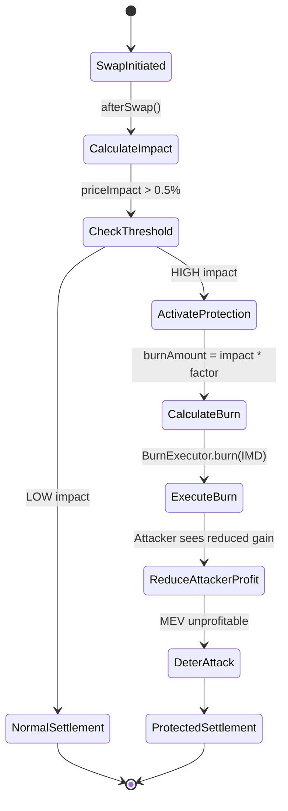
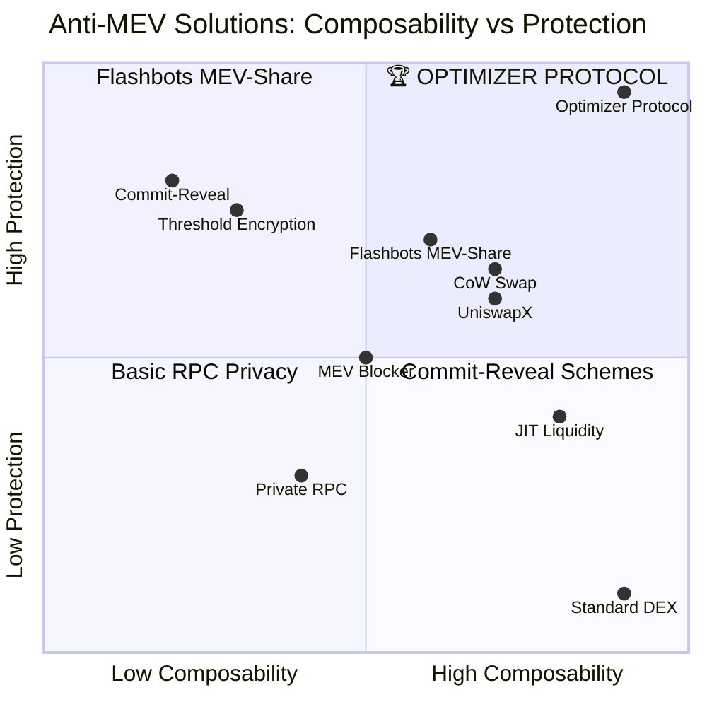
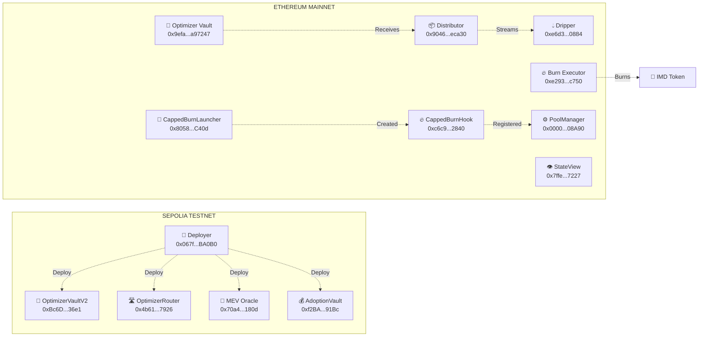
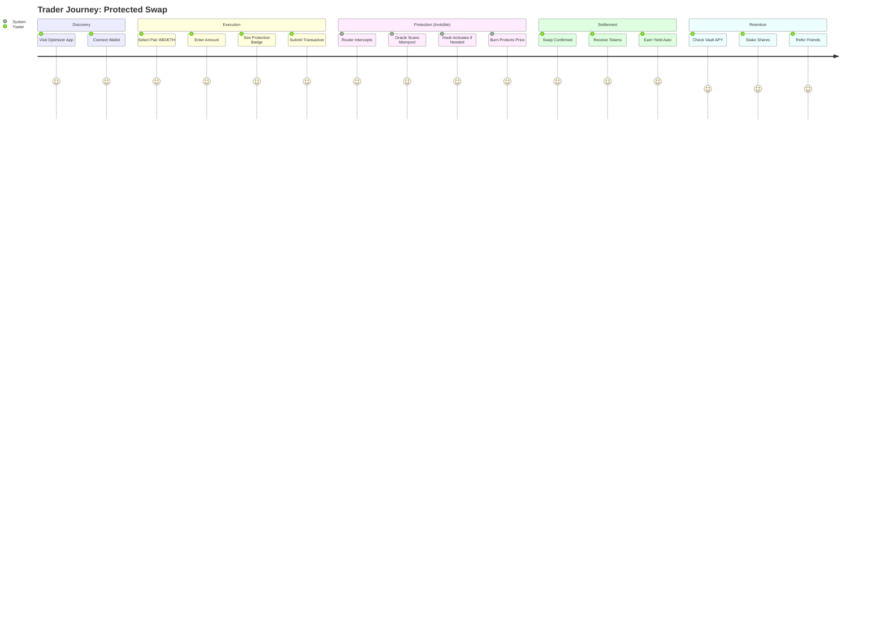

# Optimizer Protocol — Architecture Diagrams (Mermaid)

> Copy-paste these into GitHub README, docs, or Notion. Render natively on GitHub.

---

## 1. System Architecture



---

## 2. Anti-MEV Flow Sequence



---

## 3. Tokenomics Flow



---

## 4. Hook Protection Mechanism



---

## 5. MEV Oracle Detection Pipeline

```mermaid
flowchart TD
    subgraph "INGESTION"
        M1[📥 Mempool Listener\nWebSocket / RPC]
        M2[📊 Block Subscriber\nNew Block Events]
    end

    subgraph "PROCESSING"
        P1[🔍 Swap Decoder\nV4 Swap Event Parser]
        P2[👥 Trader Profiler\nAddress Clustering]
        P3[🎯 Pattern Matcher\nSandwich / JIT / Arb]
    end

    subgraph "DETECTION"
        D1[🥪 Sandwich Detector\nBuy-Victim-Sell\nSame Block]
        D2[🔄 Cross-Block Detector\nBuy→Sell ≤3 blocks\nSame Trader]
        D3[💰 Profit Estimator\nmin(buy,sell) × 0.1%\nCap: 10 ETH]
    end

    subgraph "OUTPUT"
        O1[🚨 Alert API\n/alerts endpoint]
        O2[📈 Dashboard\nReal-time UI]
        O3[🛡️ Router Signal\nProtection Flag]
        O4[📊 Analytics\nHistorical DB]
    end

    M1 --> P1
    M2 --> P1
    P1 --> P2
    P2 --> P3
    P3 --> D1
    P3 --> D2
    D1 --> D3
    D2 --> D3
    D3 --> O1
    D3 --> O2
    D3 --> O3
    D3 --> O4
```

---

## 6. Comparative Landscape



---

## 7. Deployment Topology



---

## 8. User Journey



---

## Usage

### GitHub README
```markdown
## Architecture

```mermaid
graph TB
    # ... paste diagram here ...
```
```

### Notion/Obsidian
- Paste directly — renders natively

### Mermaid Live Editor
- https://mermaid.live — paste for PNG/SVG export

### Custom Styling (CSS)
```css
.mermaid {
    background: #0a0a0a;
    color: #00ff41;
    font-family: 'JetBrains Mono', monospace;
}
```

---

**Generated:** 2026-09-24 | **Version:** 1.0 | **Repo:** github.com/AlexandreCruz76/imd-optimizer