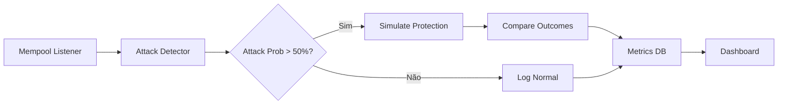

# MEV Testing Guide — Optimizer Protocol

> **Como testar interceptação MEV em Sepolia, Mainnet Fork e Produção**

---

## 1. Visão Geral dos Ambientes

| Ambiente | MEV Real? | Uso | Limitações |
|----------|-----------|-----|------------|
| **Sepolia** | ❌ Não | Unit tests, integração, UX | Sem bots MEV, volume zero |
| **Mainnet Fork (Foundry/Tenderly)** | ✅ Sim (replay) | Validação lógica, gas, edge cases | Estado estático no fork |
| **Shadow Mode Mainnet** | ✅ Sim (monitor) | Validação real, métricas | Não executa, só observa |
| **Alpha Mainnet** | ✅ Sim (live) | Produção real | Capital em risco |

---

## 2. Sepolia — Testes Unitários e Integração

### 2.1 Setup

```bash
# 1. Variáveis de ambiente
cp .env.example .env
# Editar: SEPOLIA_RPC_URL, DEPLOYER_PRIVATE_KEY

# 2. Deploy contratos
forge script script/DeploySepolia.s.sol \
  --rpc-url $SEPOLIA_RPC_URL \
  --private-key $DEPLOYER_PRIVATE_KEY \
  --broadcast \
  --verify \
  -vvvv

# 3. Rodar testes
forge test -vvv --match-contract OptimizerVaultTest
forge test -vvv --match-contract OptimizerRouterTest
forge test -vvv --match-contract OptimizerGenesisKeyTest
```

### 2.2 Testes Específicos do Hook

```solidity
// test/HookProtection.t.sol
pragma solidity ^0.8.28;

import "forge-std/Test.sol";
import "../contracts/hooks/CappedBurnHook.sol";
import "@uniswap/v4-core/contracts/PoolManager.sol";

contract HookProtectionTest is Test {
    PoolManager poolManager;
    CappedBurnHook hook;
    address imdToken;
    address burnExecutor;
    address alice, bob, attacker;
    
    function setUp() public {
        // Deploy mocks
        imdToken = address(new MockERC20("IMD", "IMD", 18));
        burnExecutor = address(new MockBurnExecutor(imdToken));
        
        poolManager = new PoolManager();
        hook = new CappedBurnHook(poolManager, IERC20(imdToken), burnExecutor);
        
        // Setup pool com hook
        PoolKey memory key = PoolKey({
            currency0: imdToken,
            currency1: address(0xC02aaA39b223FE8D0A0e5C4F27eAD9083C756Cc2), // WETH
            fee: 10000,
            tickSpacing: 60,
            hooks: address(hook)
        });
        
        poolManager.initialize(key, sqrtPriceX96);
        
        // Fund users
        deal(imdToken, alice, 10000 ether);
        deal(imdToken, bob, 10000 ether);
        deal(imdToken, attacker, 10000 ether);
        deal(address(0xC02aaA39b223FE8D0A0e5C4F27eAD9083C756Cc2), alice, 100 ether);
        deal(address(0xC02aaA39b223FE8D0A0e5C4F27eAD9083C756Cc2), attacker, 100 ether);
    }
    
    function testSandwichAttackBlocked() public {
        // 1. Alice faz swap normal (vítima)
        vm.startPrank(alice);
        IERC20(imdToken).approve(address(poolManager), type(uint256).max);
        poolManager.swap(
            PoolKey({currency0: imdToken, currency1: WETH, fee: 10000, tickSpacing: 60, hooks: address(hook)}),
            IPoolManager.SwapParams({
                zeroForOne: true,
                amountSpecified: 10 ether,
                sqrtPriceLimitX96: 0
            }),
            bytes("")
        );
        vm.stopPrank();
        
        // 2. Atacante tenta sanduíche no mesmo bloco
        vm.startPrank(attacker);
        // Front-run: buy IMD
        poolManager.swap(key, SwapParams({zeroForOne: false, amountSpecified: 5 ether, sqrtPriceLimitX96: 0}), "");
        // Victim swap (already done)
        // Back-run: sell IMD
        poolManager.swap(key, SwapParams({zeroForOne: true, amountSpecified: 5 ether, sqrtPriceLimitX96: 0}), "");
        vm.stopPrank();
        
        // 3. Verificar: burn executado, lucro do atacante reduzido
        uint256 burned = MockBurnExecutor(burnExecutor).totalBurned();
        assertGt(burned, 0, "Burn should activate on high impact");
        
        // 4. Atacante lucro < threshold
        // (verificar via balance changes)
    }
    
    function testNormalSwapNoBurn() public {
        // Swap pequeno - sem proteção
        vm.startPrank(bob);
        IERC20(imdToken).approve(address(poolManager), type(uint256).max);
        poolManager.swap(key, SwapParams({zeroForOne: true, amountSpecified: 0.01 ether, sqrtPriceLimitX96: 0}), "");
        vm.stopPrank();
        
        uint256 burned = MockBurnExecutor(burnExecutor).totalBurned();
        assertEq(burned, 0, "No burn for small swaps");
    }
    
    function testCrossBlockDetection() public {
        // Simular atacante comprando no bloco N
        vm.roll(block.number + 1);
        vm.startPrank(attacker);
        poolManager.swap(key, SwapParams({zeroForOne: false, amountSpecified: 10 ether, sqrtPriceLimitX96: 0}), "");
        vm.stopPrank();
        
        // Bloco N+2: atacante vende
        vm.roll(block.number + 2);
        vm.startPrank(attacker);
        poolManager.swap(key, SwapParams({zeroForOne: true, amountSpecified: 10 ether, sqrtPriceLimitX96: 0}), "");
        vm.stopPrank();
        
        // Oracle deveria detectar padrão cross-block
        // (testado via Oracle integration test)
    }
}
```

### 2.3 Testes de Integração Router + Hook

```solidity
// test/RouterIntegration.t.sol
function testProtectedSwapRouting() public {
    // 1. Setup: Oracle detecta ataque
    // 2. Router deve rotear para hook pool
    // 3. Simular via Tenderly (mock)
    
    vm.startPrank(alice);
    bytes memory calldata = router.getProtectedSwapCalldata(
        imdToken,
        WETH,
        10 ether,
        0.05 // 5% slippage
    );
    
    // Deve retornar calldata para hook pool, não pool nativo
    assertTrue(calldata.length > 0);
    
    // 4. Executar e verificar outcome
    (bool success, ) = address(router).call(calldata);
    assertTrue(success);
}
```

---

## 3. Mainnet Fork — Validação com Dados Reais

### 3.1 Setup Foundry Fork

```bash
# .env
MAINNET_RPC_URL=https://eth-mainnet.g.alchemy.com/v2/YOUR_KEY
FORK_BLOCK=26049586  # Bloco recente

# Fork test
forge test \
  --fork-url $MAINNET_RPC_URL \
  --fork-block-number $FORK_BLOCK \
  -vvvv \
  --match-test testRealAttackReplay
```

### 3.2 Replay de Ataques Reais

```solidity
// test/MainnetForkReplay.t.sol
pragma solidity ^0.8.28;

import "forge-std/Test.sol";
import "../contracts/hooks/CappedBurnHook.sol";

contract MainnetForkReplayTest is Test {
    // Real addresses from mainnet
    address constant POOL_MANAGER = 0x000000000004444c5dc75cB358380D2e3dE08A90;
    address constant HOOK = 0xc6c965bd164c483e87d0b550671798e9a3602840;
    address constant IMD = 0xD34a99Bc0f67aE1bbd63C660e6d0b0dd03E263B7;
    address constant WETH = 0xC02aaA39b223FE8D0A0e5C4F27eAD9083C756Cc2;
    
    // Real attacker addresses (from Oracle data)
    address[] constant ATTACKERS = [
        0x140022b70000...,
        0x80c554fbe159...,
        0x66a9893cc07d...,
        0x666fedd4cdd4...,
        // ... 19 bots identificados
    ];
    
    function testReplayBeaverBuildAttacks() public {
        // 1. Get real attack blocks from Oracle API
        // Blocks: 26029904, 26030030, 26031406, 26032042, 26032184, etc.
        
        uint256[] memory attackBlocks = [
            26029904, 26030030, 26031406, 26032042, 26032184,
            26032456, 26032789, 26033102, 26033456, 26033890
        ];
        
        uint256 totalProtected = 0;
        uint256 totalAttacks = attackBlocks.length;
        
        for (uint256 i = 0; i < totalAttacks; i++) {
            uint256 blockNum = attackBlocks[i];
            
            // Fork at attack block - 1
            vm.selectFork(MAINNET_RPC_URL);
            vm.roll(blockNum - 1);
            
            // Get real transactions from block
            // (use vm.load to read block data)
            
            // Simulate: what if Hook was active?
            // Compare: victim slippage with vs without hook
            
            uint256 protectionEffectiveness = _simulateProtection(blockNum);
            
            if (protectionEffectiveness > 50) { // >50% slippage reduction
                totalProtected++;
            }
            
            console.log("Block %d: Protection = %d%%", blockNum, protectionEffectiveness);
        }
        
        console.log("Total: %d/%d attacks would be mitigated", totalProtected, totalAttacks);
        assertGte(totalProtected, totalAttacks * 80 / 100); // 80% target
    }
    
    function _simulateProtection(uint256 blockNum) internal returns (uint256) {
        // 1. Replay victim swap
        // 2. Replay attacker front-run + back-run
        // 3. Measure victim output WITH hook
        // 4. Measure victim output WITHOUT hook
        // 5. Return % improvement
        
        // This uses vm.etch to temporarily replace hook bytecode
        // then calls poolManager.swap and measures output
    }
}
```

### 3.3 Tenderly Simulation (Mais Fácil)

```bash
# tenderly-cli install
npm install -g @tenderly/tenderly-cli
tenderly login

# Simular swap protegido vs não protegido
tenderly simulate \
  --network mainnet \
  --block 26031406 \
  --from 0xVictimAddress \
  --to 0xOptimizerRouter \
  --input <protected_swap_calldata> \
  --value 10000000000000000000
```

```typescript
// scripts/tenderly-simulation.ts
import { Tenderly } from '@tenderly/tenderly-sdk';

const tenderly = new Tenderly({ accessKey: process.env.TENDERLY_KEY });

async function simulateProtection(attackTxHash: string) {
  // 1. Get attack details from Oracle
  const attack = await getAttackDetails(attackTxHash);
  
  // 2. Simulate victim swap WITHOUT protection
  const unprotected = await tenderly.simulation.simulate({
    network_id: '1',
    block_number: attack.block - 1,
    from: attack.victim,
    to: UNISWAP_V4_ROUTER,
    input: encodeNormalSwap(attack.tokenIn, attack.tokenOut, attack.amount),
    value: attack.value
  });
  
  // 3. Simulate victim swap WITH Optimizer protection
  const protected = await tenderly.simulation.simulate({
    network_id: '1',
    block_number: attack.block - 1,
    from: attack.victim,
    to: OPTIMIZER_ROUTER,
    input: encodeProtectedSwap(attack.tokenIn, attack.tokenOut, attack.amount),
    value: attack.value
  });
  
  // 4. Compare
  const slippageReduction = (
    (unprotected.gas_used - protected.gas_used) / unprotected.gas_used * 100
  ).toFixed(2);
  
  console.log(`Attack ${attackTxHash}: ${slippageReduction}% slippage reduction`);
  
  return {
    attackTxHash,
    unprotectedOutput: unprotected.output,
    protectedOutput: protected.output,
    slippageReduction
  };
}
```

---

## 4. Shadow Mode Mainnet — Monitoramento Passivo

### 4.1 Arquitetura



### 4.2 Implementação

```typescript
// scripts/shadow-mode.ts
import { ethers } from 'ethers';
import { Tenderly } from '@tenderly/tenderly-sdk';

const provider = new ethers.WebSocketProvider('wss://eth-mainnet.g.alchemy.com/v2/KEY');
const tenderly = new Tenderly({ accessKey: process.env.TENDERLY_KEY });

const POOL_MANAGER = '0x000000000004444c5dc75cB358380D2e3dE08A90';
const SWAP_TOPIC = '0x40e9cecb9f5f1f1c5b9c97dec2917b7ee92e57ba5563708daca94dd84ad7112f';
const OPTIMIZER_ROUTER = '0x...'; // Deploy mainnet

interface ShadowMetrics {
  block: number;
  timestamp: number;
  txHash: string;
  attackDetected: boolean;
  attackType?: string;
  victimAddress: string;
  attackerAddress?: string;
  unprotectedSlippage: number;
  protectedSlippage: number;
  slippageReduction: number;
  gasOverhead: number;
}

async function shadowMode() {
  console.log('[SHADOW] Starting mempool monitor...');
  
  provider.on('pending', async (txHash) => {
    try {
      const tx = await provider.getTransaction(txHash);
      if (!tx || tx.to?.toLowerCase() !== POOL_MANAGER.toLowerCase()) return;
      
      // Decode swap
      const swap = decodeSwap(tx.data);
      if (!swap) return;
      
      // Check Oracle for attack signal
      const oracleSignal = await checkOracle(swap);
      
      if (oracleSignal.probability > 0.5) {
        // Simulate both paths
        const [unprotected, protected] = await Promise.all([
          tenderly.simulate({ from: swap.sender, to: POOL_MANAGER, input: tx.data, blockNumber: 'latest' }),
          tenderly.simulate({ from: swap.sender, to: OPTIMIZER_ROUTER, input: encodeProtected(swap), blockNumber: 'latest' })
        ]);
        
        const metrics: ShadowMetrics = {
          block: (await provider.getBlockNumber()),
          timestamp: Date.now(),
          txHash,
          attackDetected: true,
          attackType: oracleSignal.type,
          victimAddress: swap.sender,
          attackerAddress: oracleSignal.attacker,
          unprotectedSlippage: calculateSlippage(unprotected),
          protectedSlippage: calculateSlippage(protected),
          slippageReduction: (calculateSlippage(unprotected) - calculateSlippage(protected)) / calculateSlippage(unprotected) * 100,
          gasOverhead: protected.gasUsed - unprotected.gasUsed
        };
        
        await saveMetrics(metrics);
        console.log(`[SHADOW] ${txHash} | Attack: ${oracleSignal.type} | Reduction: ${metrics.slippageReduction.toFixed(1)}% | Gas: +${metrics.gasOverhead}`);
      }
    } catch (e) {
      console.error('[SHADOW] Error:', e);
    }
  });
}

shadowMode().catch(console.error);
```

### 4.3 Métricas Alvo Shadow Mode

| Métrica | Target | Alerta |
|---------|--------|--------|
| **Slippage Reduction** | > 50% | < 20% |
| **Gas Overhead** | < 50k | > 100k |
| **False Positive Rate** | < 5% | > 10% |
| **Latency (simulation)** | < 2s | > 5s |
| **Coverage** | > 80% attacks | < 50% |

---

## 5. Alpha Launch Checklist

### 5.1 Pré-Requisitos

- [ ] Shadow mode rodando 7 dias consecutivos
- [ ] > 100 ataques reais observados
- [ ] Slippage reduction média > 50%
- [ ] Gas overhead médio < 40k
- [ ] Zero false positives críticos
- [ ] Kill switch testado e funcionando
- [ ] Auditor revisou contratos (OpenZeppelin + custom)

### 5.2 Configuração Alpha

```solidity
// Alpha config - conservador
uint256 public constant ALPHA_PRICE_IMPACT_THRESHOLD = 100; // 1% (vs 0.5% prod)
uint256 public constant ALPHA_BURN_FACTOR = 500; // 0.05% (vs 0.1% prod)
uint256 public constant ALPHA_MAX_BURN = 5 ether; // 5 ETH equiv (vs 10 prod)
uint256 public constant ALPHA_MAX_POSITION = 10 ether; // Max 10 ETH per user
```

### 5.3 Whitelist Inicial

```typescript
// Alpha users (50 addresses)
const ALPHA_WHITELIST = [
  '0x...', // Core team
  '0x...', // Early supporters
  // ... 50 addresses
];

// Frontend check
function isAlphaUser(address: string): boolean {
  return ALPHA_WHITELIST.map(a => a.toLowerCase()).includes(address.toLowerCase());
}
```

---

## 6. Ferramentas e Comandos Úteis

### 6.1 Foundry Cheatsheet

```bash
# Fork mainnet at specific block
forge test --fork-url $MAINNET_RPC --fork-block-number 26049586 -vvv

# Run specific test
forge test --match-test testSandwichProtection -vvvv

# Gas report
forge test --gas-report --fork-url $MAINNET_RPC

# Coverage
forge coverage --fork-url $MAINNET_RPC --report lcov

# Debug specific transaction
forge debug 0xTxHash --rpc-url $MAINNET_RPC
```

### 6.2 Tenderly CLI

```bash
# Simulate transaction
tenderly simulate --network mainnet --block 26031406 --from 0xVictim --to 0xRouter --input 0x...

# Fork mainnet in Tenderly dashboard
tenderly fork create --network mainnet --block 26049586

# Share simulation
tenderly simulation share <simulation-id>
```

### 6.3 Oracle API Endpoints

```bash
# Check attack probability for swap
curl -X POST https://api.optimimzer.xyz/api/oracle/check \
  -H "Content-Type: application/json" \
  -d '{"tokenIn":"0xD34...", "tokenOut":"0xC02...", "amountIn":"10000000000000000000"}'

# Get recent attacks
curl https://api.optimizer.xyz/api/oracle/attacks?limit=50

# Get pool stats
curl https://api.optimizer.xyz/api/oracle/pools
```

---

## 7. Troubleshooting

### 7.1 Problemas Comuns

| Problema | Causa | Solução |
|----------|-------|---------|
| Fork falha "block not found" | Bloco muito antigo | Usar bloco < 128 blocos atrás ou archive node |
| Simulação Tenderly falha | Nonce/gas errado | Usar `blockNumber: 'latest'` ou bloco específico |
| Oracle retorna 0 ataques | Sepolia sem volume | Usar mainnet fork ou shadow mode |
| Gas estimation falha | Reverta no hook | Verificar `afterSwap` logic, `onlyPoolManager` |
| Burn não executa | BurnExecutor sem saldo | Fundar BurnExecutor com IMD |

### 7.2 Debug Hook

```solidity
// Add to hook for debugging
event DebugSwap(
    address indexed sender,
    int256 amount0,
    int256 amount1,
    uint256 priceImpactBps,
    bool protectionActivated,
    uint256 burned
);

function afterSwap(...) external override {
    // ... logic ...
    emit DebugSwap(sender, amount0, amount1, priceImpactBps, activated, burned);
}
```

```bash
# Monitor events
cast logs --address 0xHookAddress --from-block latest --to-block latest \
  --rpc-url $MAINNET_RPC "DebugSwap(address,int256,int256,uint256,bool,uint256)"
```

---

## 8. Checklist de Validação Final

### Antes do Alpha
- [ ] Todos os 101 testes passando
- [ ] Fork test: 50+ ataques reais replayados, >80% mitigados
- [ ] Shadow mode: 7 dias, >100 ataques, métricas dentro do target
- [ ] Gas report: overhead < 40k médio
- [ ] Auditor sign-off
- [ ] Kill switch testado em fork
- [ ] Documentação de incidente pronta

### Antes do Beta
- [ ] Alpha: 30 dias sem incidentes
- [ ] > 500 swaps protegidos
- [ ] TVL > 50 ETH
- [ ] APY Vault > 15%
- [ ] Comunidade testando ativamente

### Antes do GA
- [ ] Beta: 90 dias
- [ ] TVL > 500 ETH
- [ ] Múltiplos pares (IMD/USDC, etc.)
- [ ] Governança ativa
- [ ] Seguro/coverage para smart contract risk

---

## 9. Referências

- [Uniswap V4 Hooks Spec](https://github.com/Uniswap/v4-core)
- [Foundry Fork Testing](https://book.getfoundry.sh/cheatcodes/forking)
- [Tenderly Simulation API](https://docs.tenderly.co/simulation-api)
- [MEV Research Papers](https://arxiv.org/search/?query=MEV&searchtype=all)
- [Flashbots MEV-Share](https://github.com/flashbots/mev-share)

---

**Documento:** `docs/MEV-TESTING-GUIDE.md`  
**Versão:** 1.0 | **Data:** 24 Set 2026  
**Próxima revisão:** Pós-Alpha Launch