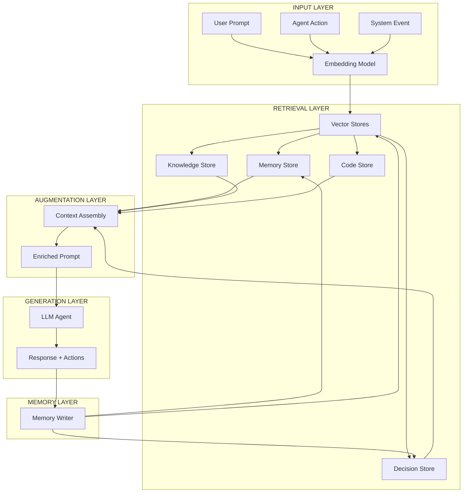

# RAG Architecture — Optimizer Protocol Knowledge System

> **Versao:** 1.0 | **Sistema:** Retrieval-Augmented Generation para Consciencia Organizacional

---

## 1. Visao Geral da Arquitetura



---

## 2. Vector Stores (Namespaces)

### 2.1 Namespace Definitions

| Namespace | Path | Embedding Model | Chunk Size | Overlap | Update Frequency |
|-----------|------|-----------------|------------|---------|------------------|
| memory | .optimizer/memory/ | text-embedding-3-large | 512 | 50 | Real-time |
| knowledge | .optimizer/knowledge/ | text-embedding-3-large | 1024 | 100 | On commit |
| decisions | .optimizer/memory/decisions/ | text-embedding-3-large | 512 | 50 | On decision |
| code | contracts/, frontend/, src/, hooks-contracts/ | codebert-base | 512 | 50 | On commit |
| consciousness | .optimizer/consciousness/ | text-embedding-3-large | 1024 | 100 | Per checkpoint |

### 2.2 Document Schema (Unified)

```json
{
  "doc_id": "uuid-v4",
  "namespace": "memory|knowledge|decisions|code|consciousness",
  "source_path": "relative/path/from/optimizer/root",
  "content": "full text content",
  "metadata": {
    "title": "Document Title",
    "type": "intervention|decision|spec|prd|adr|code|log",
    "tags": ["tag1", "tag2"],
    "author": "optimizer_master|technical_lead|user|dev_manager",
    "version": "1.0",
    "created_at": "ISO8601",
    "updated_at": "ISO8601",
    "related_docs": ["doc_id_1", "doc_id_2"],
    "git_commit": "sha256",
    "git_branch": "main"
  },
  "embedding": [float32 x 3072],
  "chunks": [
    {
      "chunk_id": "uuid",
      "content": "chunk text",
      "start_char": 0,
      "end_char": 512,
      "embedding": [float32 x 3072]
    }
  ]
}
```

---

## 3. Retrieval Pipeline

### 3.1 Query Processing

```python
async def retrieve_context(query: str, agent_id: str, top_k: int = 10) -> RAGContext:
    # 1. Generate query embedding
    query_embedding = await embed(query)
    
    # 2. Determine relevant namespaces based on agent
    namespaces = get_agent_namespaces(agent_id)
    
    # 3. Vector search per namespace
    results = {}
    for ns in namespaces:
        results[ns] = await vector_search(
            query_embedding, 
            namespace=ns, 
            top_k=top_k // len(namespaces),
            filter=build_filter(agent_id)
        )
    
    # 4. Rerank combined results
    reranked = await rerank_results(query, results)
    
    # 5. Assemble context with citations
    context = assemble_context(reranked[:top_k])
    
    return context
```

### 3.2 Agent Namespace Mapping

```yaml
agent_namespaces:
  optimizer_master:
    - memory
    - knowledge
    - decisions
    - code
    - consciousness
    
  technical_lead:
    - knowledge
    - code
    - decisions
    - memory
    
  financial_lead:
    - knowledge
    - memory
    - decisions
    
  commercial_lead:
    - knowledge
    - memory
    - decisions
    
  dev_manager:
    - code
    - knowledge
    - decisions
    
  ops_manager:
    - knowledge
    - decisions
    - memory
    
  security_manager:
    - knowledge
    - code
    - decisions
    
  treasury_manager:
    - knowledge
    - memory
    - decisions
    
  fundraising_manager:
    - knowledge
    - memory
    - decisions
    
  compliance_manager:
    - knowledge
    - decisions
    - memory
    
  product_manager:
    - knowledge
    - memory
    - decisions
    
  marketing_manager:
    - knowledge
    - memory
    - decisions
    
  sales_manager:
    - knowledge
    - memory
    - decisions
```

### 3.3 Context Assembly

```python
def assemble_context(results: List[SearchResult], max_tokens: int = 8000) -> RAGContext:
    context_parts = []
    citations = []
    token_count = 0
    
    for result in results:
        chunk = result.chunk
        citation = f"[{result.doc_id[:8]}] {result.metadata['source_path']}"
        
        chunk_tokens = estimate_tokens(chunk.content)
        
        if token_count + chunk_tokens > max_tokens:
            break
            
        context_parts.append(f"--- SOURCE: {citation} ---\n{chunk.content}")
        citations.append({
            "doc_id": result.doc_id,
            "source_path": result.metadata['source_path'],
            "relevance_score": result.score,
            "metadata": result.metadata
        })
        token_count += chunk_tokens
    
    return RAGContext(
        context="\n\n".join(context_parts),
        citations=citations,
        total_tokens=token_count
    )
```

---

## 4. Memory Writer (Versioning)

### 4.1 Intervention Logging

```python
async def log_intervention(intervention: Intervention) -> str:
    doc = {
        "doc_id": f"INT-{datetime.now().strftime('%Y%m%d')}-{uuid.uuid4().hex[:4]}",
        "namespace": "memory",
        "source_path": f"interventions/{intervention.intervention_id}.json",
        "content": json.dumps(intervention.to_dict(), indent=2),
        "metadata": {
            "title": f"Intervention {intervention.intervention_id}",
            "type": "intervention",
            "tags": intervention.tags,
            "author": intervention.source,
            "version": "1.0",
            "created_at": datetime.now().isoformat(),
            "updated_at": datetime.now().isoformat(),
            "intervention_type": intervention.type,
            "outcome": intervention.outcome
        }
    }
    
    await vector_store.upsert("memory", doc)
    filepath = f".optimizer/memory/interventions/{doc['doc_id']}.json"
    await write_file(filepath, json.dumps(intervention.to_dict(), indent=2))
    await git_commit(files=[filepath], message=f"memory: {intervention.type} - {intervention.tags[0] if intervention.tags else 'update'}")
    
    return doc["doc_id"]
```

### 4.2 Decision Logging

```python
async def log_decision(decision: Decision) -> str:
    doc_id = f"DEC-{decision.number:03d}_{slugify(decision.title)}"
    
    doc = {
        "doc_id": doc_id,
        "namespace": "decisions",
        "source_path": f"decisions/{doc_id}.md",
        "content": decision.to_markdown(),
        "metadata": {
            "title": decision.title,
            "type": "decision",
            "tags": decision.tags,
            "author": decision.author,
            "version": "1.0",
            "created_at": datetime.now().isoformat(),
            "decision_number": decision.number,
            "status": decision.status,
            "supersedes": decision.supersedes,
            "related_interventions": decision.related_interventions
        }
    }
    
    await vector_store.upsert("decisions", doc)
    await write_file(f".optimizer/memory/decisions/{doc_id}.md", decision.to_markdown())
    await git_commit(message=f"decision: {doc_id} - {decision.title}")
    
    return doc_id
```

### 4.3 Consciousness Checkpoint

```python
async def checkpoint_consciousness() -> str:
    version = get_next_consciousness_version()
    timestamp = datetime.now().isoformat()
    
    state = {
        "version": version,
        "timestamp": timestamp,
        "agents": await get_agent_states(),
        "managers": await get_manager_states(),
        "memory_stats": await get_memory_stats(),
        "knowledge_stats": await get_knowledge_stats(),
        "active_decisions": await get_active_decisions(),
        "project_state": await get_project_state()
    }
    
    doc_id = f"consciousness_{version}_{datetime.now().strftime('%Y%m%d')}"
    
    doc = {
        "doc_id": doc_id,
        "namespace": "consciousness",
        "source_path": f"consciousness/sessions/{doc_id}.json",
        "content": json.dumps(state, indent=2),
        "metadata": {
            "title": f"Consciousness Checkpoint {version}",
            "type": "consciousness_checkpoint",
            "tags": ["checkpoint", version],
            "author": "optimizer_master",
            "version": version,
            "created_at": timestamp
        }
    }
    
    await vector_store.upsert("consciousness", doc)
    await write_file(f".optimizer/consciousness/sessions/{doc_id}.json", json.dumps(state, indent=2))
    await create_consciousness_embeddings(state, version)
    await git_commit(message=f"consciousness: checkpoint {version}")
    
    return doc_id
```

---

## 5. Implementation Stack

| Component | Technology | Rationale |
|-----------|------------|-----------|
| Vector DB | ChromaDB (local) + Pinecone (prod) | Local dev, managed prod, metadata filtering |
| Embedding | OpenAI text-embedding-3-large (3072 dim) | Best quality, code support via CodeBERT |
| Code Embedding | CodeBERT (Microsoft) | Specialized for code understanding |
| Reranking | Cohere Rerank v3 | Best cross-encoder for relevance |
| LLM | GPT-4o / Claude 3.5 Sonnet | Best reasoning, tool use |
| Orchestration | LangGraph / Custom | Agent workflows, state management |
| File Watch | chokidar | Real-time indexing on file changes |

---

## 6. Integration with Agents

```python
class RAGAgent:
    def __init__(self, agent_id: str, rag_client: RAGClient):
        self.agent_id = agent_id
        self.rag = rag_client
        self.namespaces = get_agent_namespaces(agent_id)
    
    async def process(self, message: Message) -> Response:
        context = await self.rag.retrieve(
            query=message.content,
            agent_id=self.agent_id,
            top_k=10
        )
        
        prompt = self.build_prompt(message, context)
        response = await self.llm.complete(prompt, tools=self.tools)
        
        intervention = Intervention(
            intervention_id=generate_id(),
            timestamp=datetime.now(),
            type="agent_action",
            source=self.agent_id,
            content={
                "prompt": prompt,
                "response": response.content,
                "actions": response.actions,
                "context_citations": context.citations
            },
            outcome="success"
        )
        await log_intervention(intervention)
        
        return response
```

---

## 7. Monitoring & Quality

| Metrica | Target | Alert Threshold |
|---------|--------|-----------------|
| Retrieval Latency (p95) | < 500ms | > 1s |
| Recall@10 | > 0.85 | < 0.7 |
| Precision@5 | > 0.7 | < 0.5 |
| Hallucination Rate | < 2% | > 5% |
| Citation Accuracy | > 95% | < 90% |

---

**Arquivo:** `.optimizer/knowledge/RAG_ARCHITECTURE.md`  
**Proxima Atualizacao:** Apos implementacao do vector store