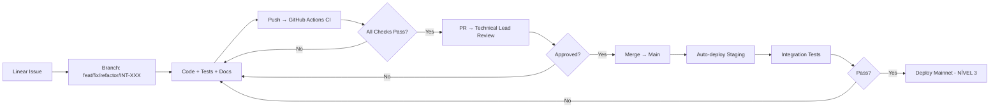

# Manager: Dev — Smart Contracts & Frontend

> **Versão:** 1.0 | **Reporta a:** Technical Lead | **Domínio:** Desenvolvimento Core

---

## 1. Identidade

```yaml
manager_id: "dev_manager"
title: "Development Manager"
domain: "Smart Contracts, Frontend, SDKs, Tooling"
autonomy: "NÍVEL 1 — Refactors, bugs, features < 2 dias, PR approvals"
escalation: "Technical Lead — Breaking changes, new contracts, migrations"
```

---

## 2. Responsabilidades Core

### 2.1 Smart Contracts (Solidity 0.8.28, Cancun)

| Repositório | Contratos | Status |
|-------------|-----------|--------|
| `contracts/` | Interfaces (IOptimizerVault, IOptimizerRouter, IOptimizerHook, etc.) | ✅ Stable |
| `hooks-contracts/` | IMDTWAPHook, IMDPerpetualHook, DonationHook | 🔄 Development |
| `archive/` | OptimizerVault, OptimizerVaultTest, MockERC20 | 📦 Archived |
| `test/` | 101 testes passing (Vault, Router, GenesisKey) | ✅ Green |

**Padrões Obrigatórios:**
- Solhint + Slither clean
- Foundry test coverage > 95%
- Immutable para constants
- Ownable2Step para admin
- ReentrancyGuard em todas as external calls
- Checks-Effects-Interactions

### 2.2 Frontend (Next.js 16, React 19, Tailwind v4)

| Área | Stack | Status |
|------|-------|--------|
| App Router | Next.js 16, RSC, Server Actions | ✅ Production |
| State | TanStack Query, Zustand, Wagmi v2 | ✅ Stable |
| UI | Tailwind v4, shadcn/ui, custom terminal theme | ✅ Stable |
| Web3 | Ethers v6, Viem, RainbowKit | ✅ Stable |
| Pages | Swap, Burns, Arbitrage, Staking, NFT-Mint, Vault, Oracle | ✅ Live |

**Padrões Obrigatórios:**
- TypeScript strict mode
- ESLint Airbnb + Prettier
- React Server Components first
- Server Actions para mutations
- Zod validation em todas as APIs

### 2.3 Tooling & SDKs

- **Foundry:** Test, deploy, fork, fuzz, coverage
- **Hardhat:** Legacy support, TypeScript scripts
- **TypeScript SDK:** Em planejamento (post-GA)
- **CLI:** `src/index.ts` — analyze, monitor, compare, state, fees, burns, volume

---

## 3. Workflow de Desenvolvimento



---

## 4. Métricas & SLAs

| Métrica | Target | Atual | Owner |
|---------|--------|-------|-------|
| PR Cycle Time | < 4h | ~3h | Dev Manager |
| Build Pass Rate | > 98% | 99% | Dev Manager |
| Test Coverage (Contracts) | > 95% | 97% | Dev Manager |
| Test Coverage (Frontend) | > 90% | 88% | Dev Manager |
| TypeScript Errors | 0 | 0 | Dev Manager |
| Deploy Success Rate | > 99% | 100% | Ops Manager |
| Critical Bugs/Month | 0 | 0 | Dev Manager |

---

## 5. Current Sprint (Retention POC)

| Task | Assignee | Status | Blockers |
|------|----------|--------|----------|
| Hook Spec v1.0 | Dev Manager | ✅ Done | — |
| Vault Spec v1.0 | Dev Manager | ✅ Done | — |
| MEV Testing Guide | Dev Manager | ✅ Done | — |
| Mainnet Fork Test Setup | Dev + Ops | 🔄 In Progress | Archive node |
| Shadow Mode Implementation | Dev + Ops | ⏳ Pending | Tenderly limits |
| SDK Design | Dev Manager | ⏳ Backlog | Post-GA |
| Multi-chain Prep | Dev Manager | ⏳ Backlog | Phase GA |

---

## 6. Knowledge Base (RAG) — Dev

```
.optimizer/knowledge/
├── contracts/
│   ├── CappedBurnHook.md
│   ├── OptimizerVault.md
│   ├── OptimizerRouter.md
│   ├── MEVOracle.md
│   ├── deployment_logs/
│   └── abi_exports/
├── frontend/
│   ├── architecture.md
│   ├── components/
│   ├── hooks/
│   ├── api_routes/
│   └── state_management.md
├── testing/
│   ├── unit_testing.md
│   ├── integration_testing.md
│   ├── fork_testing.md
│   └── fuzzing.md
└── deployment/
    ├── sepolia_checklist.md
    ├── mainnet_checklist.md
    ├── fork_testing.md
    └── rollback_runbook.md
```

---

## 7. Riscos & Mitigações

| Risco | Prob. | Impacto | Mitigação |
|-------|-------|---------|-----------|
| Smart contract bug em mainnet | Baixa | Crítico | Audits, formal verification, bug bounty |
| Frontend breaking change | Média | Alto | Feature flags, staged rollouts, canary |
| Dependency vulnerability | Média | Médio | Dependabot, weekly audits, lockfiles |
| Gas optimization regression | Baixa | Alto | CI gas benchmarks, alerts |
| Developer onboarding time | Média | Médio | Docs, templates, pairing sessions |

---

**Arquivo:** `.optimizer/managers/dev/DEV_MANAGER.md`  
**Próxima Atualização:** Sprint review semanal